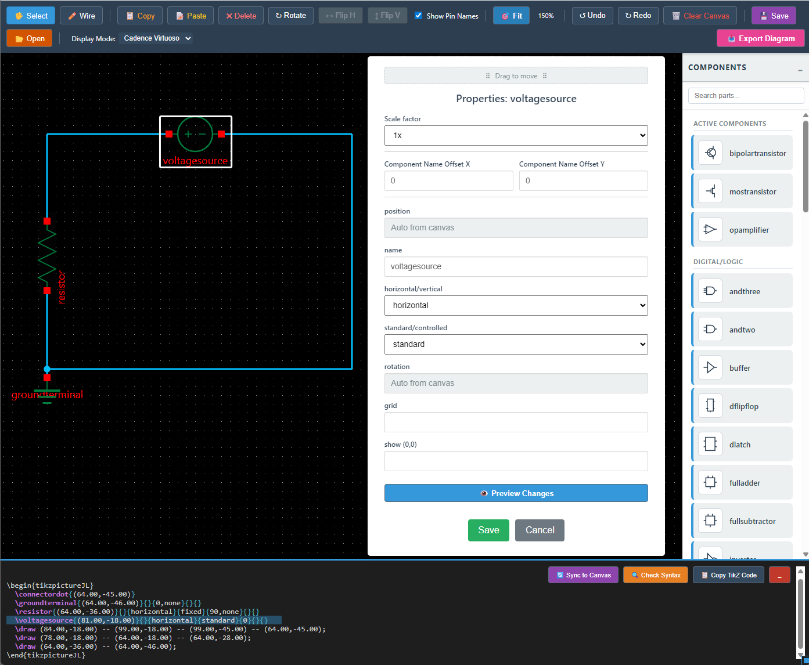

# JL TikZ CAD ⚡

A complete ecosystem for designing electronic circuits in the browser and generating professional **LaTeX (TikZ)** code for academic and engineering publications.

## 📂 Project Ecosystem
This repository is organized into three main functional areas:

* **[Circuit Designer (Live App)](./index.html):** The main web-based CAD tool to sketch circuits and export TikZ.
* **[Developer Tools](./developer-tools/):** The Visual Component IDE used to draw and define new symbols for the library.
* **[Automation Suite](./automation/):** Python scripts to sync the library and batch-compile SVG metadata into high-quality TikZ macros.

## ✨ Core Features
- **Visual Grid Editor**: Drag-and-drop interface with automatic 40px grid snapping.
- **Bi-directional Sync**: Modify LaTeX code and sync changes directly back to the canvas.
- **Dynamic Themes**: Switch instantly between **Standard** and **Cadence Virtuoso** display modes.
- **Component Database**: library that syncs automatically with your `.sty` file.
- **Full Compiler Pipeline**: Draw icons visually; let Python handle the complex SVG-to-TikZ math.

## 🚀 Quick Start
1. Open `index.html` in any modern browser.
2. Drag components from the palette to the workspace.
3. Use the **LaTeX Export** panel to get your code for your `.tex` document.

  

